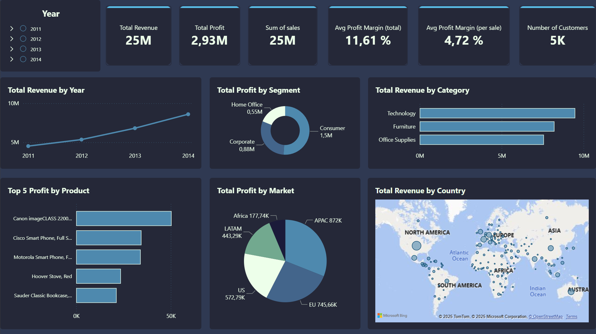

# Global-Superstore-Sales-Analysis

# Overview

A beginning-to-end analysis of the Global Superstore dataset during the years 2011-2014 using SQL and Power BI to uncover insights into sales, profit, customer, segments, shipping methods, and others. This project was created to practice full workflow skills in SQL querying, data cleaning, and data visualization.

# Main files to explore:

- README.md → project explanation
- Power BI dashboard → powerbi/visualisations.pbix
- SQL queries → sql/...

# Tools used

- PostgreSQL
- VSCode
- Power B.I.
I used PostgreSQL as the database management system connected to VSCode that I used as my IDE. This powerful combination of systems allowed me to not only create the database but also clean it and extract some preliminary insights by doing exploratory data analysis while Power B.I. allowed me to derive the visualisations needed supported by DAX.

# Dataset

The data for the Global-Superstore analysis was gathered from Kaggle which contains several different useful parameters for analysis including clients, sales, profit, order date, category, segment, region, country, shipping cost, among many others.
- File: superstore.csv
- Source: Kaggle
- Rows / Columns: 102,580 rows × 26 columns

To assess the quality and integrity of the data, the following checks were done:
- Check for missing values on the table
```sql
-- SQL query to check for null values in any column of the 'orders' table
SELECT COUNT(*) AS rows_with_nulls
FROM orders
WHERE 
    Category IS NULL
 OR city IS NULL
 OR country IS NULL
 OR customer_ID IS NULL
 OR customer_Name IS NULL
 OR discount IS NULL
 OR market_1 IS NULL
 OR number_of_records IS NULL
 OR order_date IS NULL
 OR order_ID IS NULL
 OR order_priority IS NULL
 OR product_id IS NULL
 OR product_name IS NULL
 OR quantity IS NULL
 OR region IS NULL
 OR row_id IS NULL
 OR sales IS NULL
 OR segment IS NULL
 OR ship_date IS NULL
 OR ship_mode IS NULL
 OR shipping_cost IS NULL
 OR state IS NULL
 OR sub_category IS NULL
 OR market_2 IS NULL
 OR week_number IS NULL
 OR year IS NULL
 ```
| rows_with_nulls|
|:--------------:|
| 0              |

- Check if the order date and shipping dates are correctly assessed (order date must be prior to the shipping date)
```sql
-- Ensure all ship dates come on or after the order date
SELECT COUNT(*) AS bad_dates
FROM orders
WHERE Ship_Date < Order_Date;
```
| bad_dates      |
|:--------------:|
| 0              |

# Questions

These are some of the questions that I self-imposed in order to practice my data analysis skill-set.
1. Which product categories generate the most sales and profit?
2. What is the monthly revenue trend over time for the latest year?
3. Which customer segment is most profitable?
4. How does shipping mode impact sales and costs in the latest year?
5. Which countries/regions are the top contributors to revenue?

# The Analysis

## 1. Which product categories generate the most sales and profit?

In order to find out which product categories are the most advantageous in terms of sales and profit, I did a sum of all sales and profits and grouped them by category ordering them in descending order in terms of sales. In order to draw some preliminary insights, these were compared with the total profit in each category as well.

```sql
-- Top categories by revenue and profit
SELECT
    category,
    SUM(sales) AS total_revenue,
    ROUND(SUM(profit)) AS total_profit
FROM
    orders
GROUP BY
    category
ORDER BY
    total_revenue DESC
--    total_profit DESC
```

| Category        | total_revenue | total_profit |
|:---------------:|:-------------:|:------------:|
| Technology      | 9,489,382     | 1,327,557    |
| Furniture       | 8,221,768     | 570,409      |
| Office Supplies | 7,574,660     | 1,036,948    |

The product categories that generate the most ammount of revenue is technology, closely followed up by furniture and office supplies.
However, when we look at profit, technology leads and furniture is the least profitable category by a significant margin.
This indicates that while furniture still generates a lot of revenue, its profit margins are lower compared to technology and office supplies.

## 2. What is the monthly revenue trend over time for the latest year?

In order to have a clearer picture of this trend, it was necessary to extract and separate the date hierarchy, adding them as new columns into the database in their separate forms.

```sql
-- Add new columns for year, month, and day
ALTER TABLE orders
ADD COLUMN order_year INT,
ADD COLUMN order_month INT,
ADD COLUMN order_day INT;

-- Populate the new columns with extracted values from order_date
UPDATE orders
SET 
    order_year  = EXTRACT(YEAR FROM order_date),
    order_month = EXTRACT(MONTH FROM order_date),
    order_day   = EXTRACT(DAY FROM order_date);

-- Delete previous YEAR column
ALTER TABLE orders
DROP COLUMN year
```
From there we can now proceed to the desired query which in this case is a monthly analysis of the latest year which is 2014

```sql
-- Monthly revenue trend for 2014
SELECT
    order_month,
    SUM(sales) AS total_revenue
FROM
    orders
WHERE
    order_year = 2014
GROUP BY
    order_month
ORDER BY
    total_revenue DESC
```
| order_month     | total_revenue |
|:---------------:|:-------------:|
| 11              | 1110624       |
| 12              | 1006308       |
| 9               | 962372        | 
| 8               | 913266        |
| 10              | 845570        |
| 6               | 803686        |
| 5               | 576808        |
| 3               | 526220        |
| 7               | 517436        |
| 4               | 485562        |
| 1               | 482534        |
| 2               | 369696        |

The monthly revenue trend for 2014 shows fluctuations throughout the year.
Notably, there is a significant peak in November and December, likely due to holiday shopping which suggests that seasonal factors may play a crucial role in revenue generation.

## 3. Which customer segment is the most profitable?

To know which of the three customer segments is the most profitable I grouped the segments and filtered them by profit and revenue, also adding the profit margin for a more clear and concise picture.

```sql
SELECT
    segment,
    SUM(sales) AS total_revenue,
    SUM(profit) AS total_profit,
    ((SUM(profit) / SUM(sales)) * 100) AS profit_margin_percentage
FROM
    orders
GROUP BY
    segment
ORDER BY
    profit_margin_percentage DESC
```

| Segment        | total_revenue | total_profit | profit _margin_percentage |
|:--------------:|:-------------:|:------------:|:-------------------------:|
| Home Office    | 4,619,912     | 554,018      | 11.992                    |
| Corporate      | 7,649,616     | 882,416      | 11.535                    |
| Consumer       | 13,016,282    | 1,498,480    | 11.512                    |

The customer segment with the highest profit margin is the Home Office segment, indicating that this segment is the most profitable relative to its sales.
This suggests that focusing marketing and sales efforts on the Home Office segment could be beneficial for maximizing profitability.
However, the Consumer segment is the growth driver, with the highest revenue and profit volume.
The profit margin for all segments is very close, indicating that each segment contributes similarly to overall profitability.

## 4. How does shipping mode impact sales and profit in the latest year?

In order to tackle this question I had to put side by side the total sales, profit, and shipping costs (average and total) for value comparison.


```sql
-- How does shipping mode impact sales and profit in the latest year?

SELECT
    ship_mode,
    SUM(sales) AS total_sales,
    SUM(profit) AS total_profit,
    AVG(shipping_cost) AS avg_shipping_costs,
    SUM(shipping_cost) AS total_shipping_costs
FROM 
    orders
WHERE
    order_year = 2014
GROUP BY 
    ship_mode
ORDER BY
    total_sales DESC;
```

| Segment        | total_sales | total_profit | avg_shipping_costs | total_shipping_costs |
|:--------------:|:-----------:|:------------:|:------------------:|:--------------------:|
| Standard Class | 5,068,314   | 581,112      | 20.038             | 418,350.268          |
| Second Class   | 1,800,690   | 222,094      | 30.551             | 217,828.872          |
| First Class    | 1,303,732   | 150,822      | 40.307             | 209,839.481          |
| Same Day       | 427,346     | 54,305       | 40.581             | 74,992.958           |

Standard Class shipping is the most commonly chosen shipping mode, driving the highest sales and profit with the lowest average shipping cost. 
Faster modes like First Class and Same Day shipping have much higher average shipping costs but contribute relatively little to sales or profit, suggesting customers prefer affordable delivery over speed. 
Second Class falls in between, showing some demand for faster delivery at a moderate premium rate.

## 5. Which countries/regions are the top contributors to revenue?

For this measurement, I listed the top 10 countries regarding total sales and profit, and ordered the list by profit in order to assess the consistency of regional markets throughout the timespan of our data.

```sql
SELECT
    country,
    SUM(sales) AS total_sales,
    SUM(profit) AS total_profit,
    order_year
FROM
    orders
GROUP BY
    country,
    order_year
ORDER BY
    total_profit DESC
LIMIT 10
```
| Country        | Total Sales | Total Profit | Year |
|:--------------:|:-----------:|:------------:|:----:|
| United States  | 1,468,032   | 187,015.03   | 2014 |
| United States  | 1,217,046   | 163,453.86   | 2013 |
| United States  |   941,120   | 123,237.21   | 2012 |
| United States  |   968,510   |  99,087.95   | 2011 |
| India          |   410,068   |  97,615.35   | 2014 |
| China          |   437,950   |  93,587.99   | 2014 |
| China          |   391,362   |  88,947.87   | 2013 |
| United Kingdom |   388,010   |  73,511.20   | 2014 |
| Germany        |   433,066   |  71,912.09   | 2014 |
| France         |   616,874   |  70,284.22   | 2014 |

Clearly, the countries with the highest profits are the most significant markets for the business, and the USA consistently shows the highest profits, indicating a strong market presence thoughout the years.
However, new markets like India, China, and regionally Europe, are emerging as significant contributors to profit, suggesting potential growth opportunities.

The visualisations in Power B.I. paint a clearer global picture in this time frame.




The top contributors to revenue are primarily the United States, major European markets (such as Germany, France, and the UK), and countries in the Asia-Pacific region (including India, China, and Australia).
At a regional level, APAC, Europe, and the US are the leading markets, while LATAM and Africa contribute less in comparison.

# Key KPIs

The analysis includes the following global core metrics and visuals that can be seen in the image above as well as in the *.pbix file to get deeper understandings on the variation throughout time:

- Total Revenue: 25M 
- Total Profit: 2.93M
- Average Profit Margin (total): 11.61%
- Average Profit Margin (per sale): 4.72%
- Number of Customers: 5K
